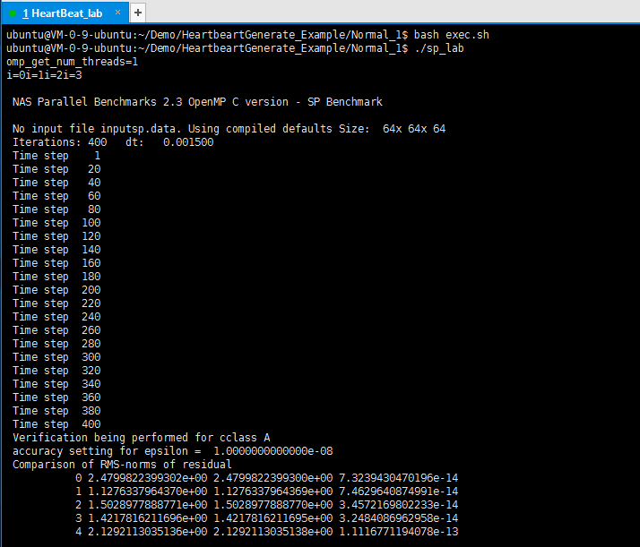
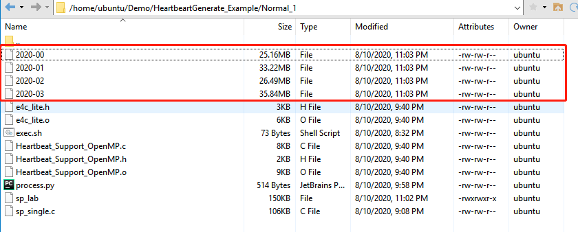
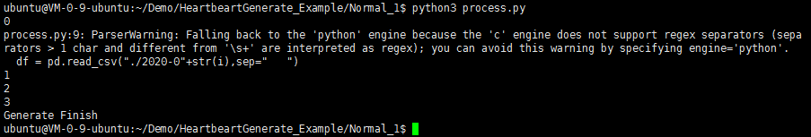
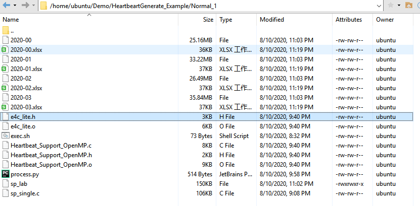

# 1 Introduction
## 1.1 The introduction of file

The main purpose of this program is to generate the heart rate of the corresponding thread in real time based on the OPENMP multi-threaded task. In addition to generating normal thread heart rate, this program can artificially construct thread heart rate changes in abnormal conditions (Shutdown, Memory leaks). The following table is a simple program introduction.

| Filename | Description |
|:----|:----|
| Heartbeat_Support_OpenMP.c   | Heartbeat detection main program |
| Heartbeat_Support_OpenMP.h   | Heartbeat detection header file |
| Heartbeat_Support_OpenMP.o   | Heartbeat detection target file |
| e4c_lite.h   | Exception detection header file |
| e4c_lite.o   | Exception detection target file |
| exec.sh   | The configuration script |


## 1.2 Operating environment

Operating system: ubuntu 16.04 LTS

RAM: 7.7GiB

Processor: Inter Core i5-4210H CPU @ 2.90GHz x 4

Operating system bit: 64-bit

GCC version: 9.3.0

```
gcc --version
```


# 2 Manual

## 2.1 Obtain the target file
When generating the target file, we need to define the number of checking threads and thread cycle and the content can be found in the Heartbeat_Support_OpenMP.h file. This experiment uses 4 threads with a frequency of 1000 as an example.

```
#define NUM_THREADS 4
#define HEART_FREQUENCY 1000
```

In the source file, run the following command to get **Heartbeat_Support_OpenMP.o** file

```
bash exec.sh
```
The script exec.sh code is as follows:
```
gcc -fopenmp -c  Heartbeat_Support_OpenMP.c -lm
```


## 2.2 Embed the heartbeat code
Open a benchmark program, such as sp_single program. Put the required API program into it.


### 2.2.1 Import API
Open sp_single.c file and add function reference library

```
#include "e4c_lite.h"
#include "Heartbeat_Support_OpenMP.h"
#include<sys/time.h>
```
### 2.2.2 Add heartbeat initialization function
Find the main() function and place the initialization program under the main() function:

```
//**************************************
    L_Heartbeat_OpenMP_Init();             
//**************************************
```
### 2.2.3 Add heartbeat generation and detection functions
In a double loop structure in the OPENMP environment in the program, embed the following code:

```
# Initialize a loopnum variable and place it outside the double loop
int loopnum=0;
# Double loop structure in OPENMP environment
for(){
  for(){
       ...
       
       //********************************
       // Number of iterations
       int iter=i*j;
       // Heartbeat generation and detection
       L_Heartbeat_OpenMP_Generate(omp_get_thread_num(),loopnum,,iter);
       //********************************
 }
}
```
### 2.2.4 Add end function
Find the end of the main() function, and place the heartbeat detection end function

```
//************************************
    L_Heartbeat_OpenMP_Finished();
//************************************
```
## 2.3 Joint compilation
### 2.3.1  Compiler
If you need to detect the heartbeat information of sp_sing.c, you need to combine the target file running in 2.1 to perform joint compilation to obtain the executable file **sp_lab**. Run the script as follows

```
bash exec.sh
```
The script code exec.sh is as follows:
```
gcc -fopenmp Heartbeat_Support_OpenMP.o e4c_lite.o sp_single.c -lm -o sp_lab
```

### 2.3.2 Execute program
Enter the following program on the command line to execute it. It can be observed that the heart rate file is generated.

```
./sp_lab
```


In addition, as the program runs, you can see that the program is continuously generating the heart rate of the corresponding thread.




## 2.4 Heartrate output result

Execute the program process.py program to convert the results generated by the program into xlsx format files for analysis and observation. The execution procedure is as follows.

```
python3 process.py
```



From the folder, you can see that the 2020-00.xlsx and 2020-01.xlsx files are generated, and they are converted from 2020-00 and 2020-01 through python.



The specific data is shown in the table below, which is the result of 2020-00.xlsx.


## 2.5 Exception setting

### 2.5.1 Normal operation
No treatment.

###  2.5.2 Memory leak
Based on malloc dynamic memory creation, memory is created multiple times in a double loop, causing memory leakage.

```
# Location: Execution file, such as in sp_string of NPB
# Set the memory leak, the parameter is the memory bit created each time
 malloc(10.24)
```
### 2.5.3 Shutdown
Based on the exit() abnormal exit function, the phenomenon of sudden interruption when the program thread is running is created.

exit(1) means abnormal exit, some prompt information can be given before exit, or the cause of the error can be observed in the debugger.

```
# Located in the heartbeat program Heartbeat_Support_OpenMP.c file
if(heart[k].counter>Shutdown_index){
      printf("Thread shutdown");
      pthread_exit((void*)heart[k].tid);
      exit(1);
}
```


