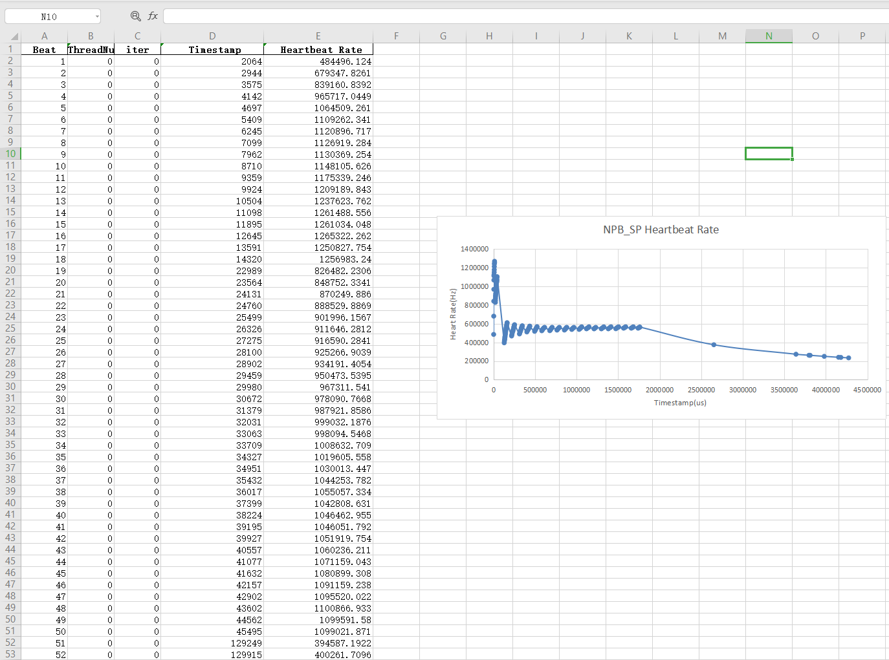

# 1 Introduction
## 1.1 Description

The main purpose of this program is to generate the heart rate of the corresponding thread at runtime based on the OpenMP multi-threaded tasks. In addition to generating normal thread heart rate, this program can artificially adjust thread heart rate changes in abnormal conditions (shutdown, memory leak). The following table is a simple program description. The e4c library (e4c_lite.h and e4c_lite.o), an open-source related with exceptions, is invoked in our some cases, you can get the detail from [here](https://github.com/guillermocalvo/exceptions4c).

| Filename | Description |
|:----|:----|
| Heartbeat_Support_OpenMP.c   | Heartbeat detection main program |
| Heartbeat_Support_OpenMP.h   | Heartbeat detection header file |
| Heartbeat_Support_OpenMP.o   | Heartbeat detection target file |
| e4c_lite.h   | Exception detection header file |
| e4c_lite.o   | Exception detection target file |
| exec.sh   | The configuration script |


## 1.2 Operating environment

Operating system: Ubuntu 16.04 LTS

RAM: 7.7GiB

Processor: Standard S2.LARGE8 v4 CPU

Operating system bit: 64-bit

GCC version: 9.3.0

```
gcc --version
```


# 2 Manual

## 2.1 Obtain the Target File
When generating the target file, we need to define the number of checking threads and thread cycle and the content can be found in the Heartbeat_Support_OpenMP.h file. This experiment uses 4 threads when the frequency is adjusted at 1000 as an example.

```
#define NUM_THREADS 4
#define HEART_FREQUENCY 1000
```

In the source file, run the following command to get **Heartbeat_Support_OpenMP.o** file

```
bash exec.sh
```
The script exec.sh code is as follows:
```
gcc -fopenmp -c  Heartbeat_Support_OpenMP.c -lm
```


## 2.2 Heartbeats **Embedded**
Open a benchmark program, such as sp_single program. Put the required API program into it.


### 2.2.1 Import API
Open sp_single.c file and add function reference library

```
#include "e4c_lite.h"
#include "Heartbeat_Support_OpenMP.h"
#include<sys/time.h>
```
### 2.2.2 Heartbeat Initialization Function
Find the main() function and place the initialization program in the main() function:

```
//**************************************
    L_Heartbeat_OpenMP_Init();             
//**************************************
```
### 2.2.3 **Heartbeat Generation** Functions
In a double loop structure in the OpenMP environment, inject the following code:

```
# Initialize a loop number variable and place it outside the double loop
int loopnum=0;
# Double loop structure in OPENMP environment
for(){
  for(){
       ...
       
       //********************************
       // Number of iterations
       int iter=i*j;
       // Heartbeat generation and detection
       L_Heartbeat_OpenMP_Generate(omp_get_thread_num(),loopnum,,iter);
       //********************************
 }
}
```
### 2.2.4 End Function
Find the end of the main() function, and place the heartbeat detection end function

```
//************************************
    L_Heartbeat_OpenMP_Finished();
//************************************
```
## 2.3 Compilation
### 2.3.1  Compiler
If you need to obtain the heartbeat information of sp_sing.c, you need to combine the target file running in 2.1 to perform joint compilation to obtain the executable file **sp_lab**, and then execute the script as follows

```
bash exec.sh
```
The script code exec.sh is as follows:
```
gcc -fopenmp Heartbeat_Support_OpenMP.o e4c_lite.o sp_single.c -lm -o sp_lab
```

### 2.3.2 Program Execution
Enter the following program on the command line to execute it. It can be observed that the heartbeat data file is generated.

```
./sp_lab
```


In addition, as the program runs, you can observe that the program is continuously outputting heartbeat data of the corresponding thread.


## 2.4 **Heartbeat** Records

Execute the program process.py file to convert the results into .xlsx format for analysis and observation. The execution command is as follows.

```
python3 process.py
```


From the folder, you can see that the 2020-00.xlsx and 2020-01.xlsx files are generated, and they are converted from 2020-00 and 2020-01 through python.


The specific data is shown in the table below, which is the result of 2020-00.xlsx.




## 2.5 Exception Setting

### 2.5.1 Normal Operation
No treatment.

###  2.5.2 Memory Leak
Based on malloc dynamic memory creation, memory is created multiple times in a double loop, causing memory leak.

```
# Location: Execution file, such as in sp_string of NPB
# Set the memory leak, the parameter is the memory bit created each time
 malloc(10.24)
```
### 2.5.3 Shutdown
Based on the exit() abnormal exit function, the case of sudden interruption when the program thread is running is created.

exit(1) means abnormal exit, some prompt information can be given before exit, or the cause of the error can be observed in the debugger.

```
# Located in the heartbeat program Heartbeat_Support_OpenMP.c file
if(heart[k].counter>Shutdown_index){
      printf("Thread shutdown");
      pthread_exit((void*)heart[k].tid);
      exit(1);
}
```


